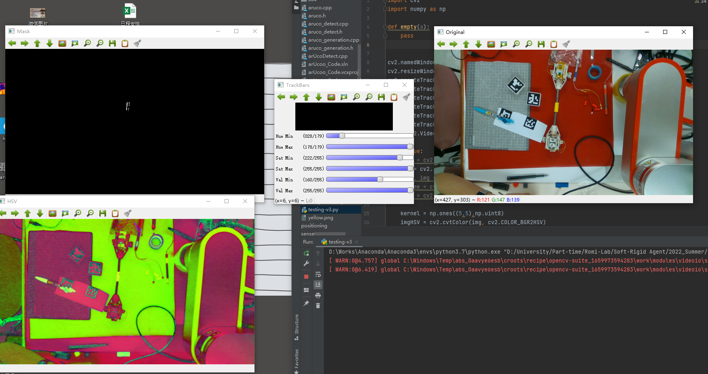

# This is the useful code of HSV method to process images through colors

#### HSV_testing.py
  - Used for testing the range of H, S, V
  By draging the bar, can use it to confirm the range of HSV
  
  
#### HSV_centerPoint.py
   * Used for detecting the center point of the target. 
   * First detect the image and extract the target color from the image. 
   * Then use 'erode' to process the edge & small dots for a more accurate result. 
   * Draw contours and mark their positions by using the function 'drawMyContours'. 
   * Use a filter to filter out some unexpected contours by counting the length of the contour. 
   * Show the filtered contours and use their position to calculate the center point (can be used to calculate the edge or other points relate to contours. 

```
left_point_x = np.min(box[:, 0])
    right_point_x = np.max(box[:, 0])
    top_point_y = np.min(box[:, 1])
    bottom_point_y = np.max(box[:, 1])

    left_point_y = box[:, 1][np.where(box[:, 0] == left_point_x)][0]
    right_point_y = box[:, 1][np.where(box[:, 0] == right_point_x)][0]
    top_point_x = box[:, 0][np.where(box[:, 1] == top_point_y)][0]
    bottom_point_x = box[:, 0][np.where(box[:, 1] == bottom_point_y)][0]

    center_point_x = (left_point_x + right_point_x) / 2
    center_point_y = (top_point_y + bottom_point_y) / 2
    center_point = np.int0([center_point_x, center_point_y])
    

    
    
